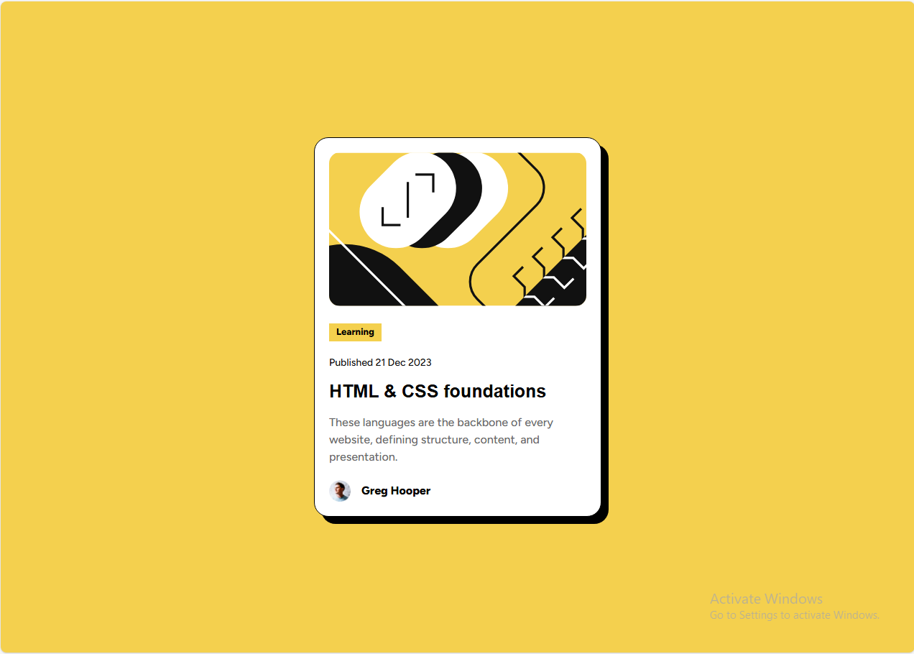

# Frontend Mentor - Blog preview card solution

This is a solution to the [Blog preview card challenge on Frontend Mentor](https://www.frontendmentor.io/challenges/blog-preview-card-ckPaj01IcS).
## Table of contents

- [Overview](#overview)
  - [The challenge](#the-challenge)
  - [Screenshot](#screenshot)
  - [Links](#links)
- [My process](#my-process)
  - [Built with](#built-with)
  - [What I learned](#what-i-learned)
  - [Continued development](#continued-development)
  - [Useful resources](#useful-resources)
- [Author](#author)
- [Acknowledgments](#acknowledgments)

## Overview

### The challenge

Users should be able to:

- See hover and focus states for all interactive elements on the page

### Screenshot



### Links

- Solution URL: [Add solution URL here](https://github.com/Abdul-RahmanNasser/blog-preview-card)
- Live Site URL: [Add live site URL here](https://abdul-rahmannasser.github.io/blog-preview-card/)

## My process

### Built with

- Flexbox
- margin and padding properties
- width property with value is fit-content
- width and height properties is full screen
- line-height property
- box-shadow
- img element with width property with value 100%
- colors and background-color by using variables
- font-face

### What I learned

```css
.proud-of-this-css {
  @font-face {
    font-family: name;
    src: url(extension);
  }
  element {
    font-family: name;
  }
  element {
    width: fit-content;
  }
}
```
### Continued development

I want to continue focusing on in responsive, flexbox, css framework, css grid.

### Useful resources

- [w3schools](https://www.w3schools.com/cssref/atrule_font-face.php) - This helped me for CSS @font-face rule. I really liked this web and will use it going forward.
- [normalize file](https://necolas.github.io/normalize.css/) - This is an amazing web which helped me finally normalize my web. I'd recommend it to anyone still working as a front-end developer.

## Author

- Website - [Abdul-Rahman Nasser](http://127.0.0.1:5500/index.html)
- Frontend Mentor - [@Abdul-RahmanNasser](https://www.frontendmentor.io/profile/Abdul-RahmanNasser)
- Twitter - [@NasrAlstar](https://x.com/NasrAlstar)

## Acknowledgments

Thanks for anyone that helped me to improved this project and i'd like to more comments to improved this project.