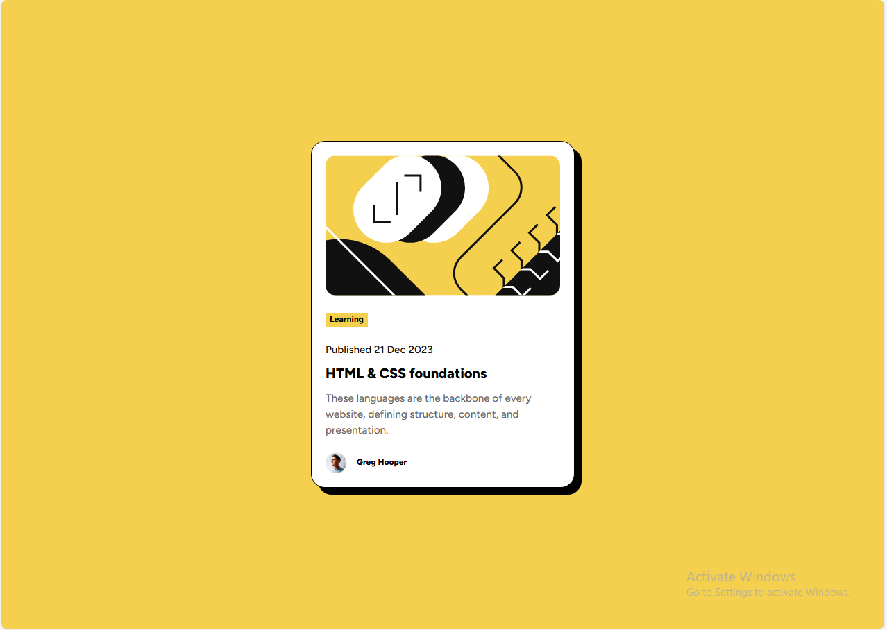

# Frontend Mentor - Blog preview card solution

This is a solution to the [Blog preview card challenge on Frontend Mentor](https://www.frontendmentor.io/challenges/blog-preview-card-ckPaj01IcS).
## Table of contents

- [Overview](#overview)
  - [The challenge](#the-challenge)
  - [Screenshot](#screenshot)
  - [Links](#links)
- [My process](#my-process)
  - [Built with](#built-with)
  - [What I learned](#what-i-learned)
  - [Continued development](#continued-development)
  - [Useful resources](#useful-resources)
- [Author](#author)
- [Acknowledgments](#acknowledgments)

## Overview

### The challenge

Users should be able to:

- See hover and focus states for all interactive elements on the page

### Screenshot



### Links

- Solution URL: [GitHub Repository](https://github.com/Abdul-RahmanNasser/blog-preview-card)
- Live Site URL: [GitHub Pages](https://abdul-rahmannasser.github.io/blog-preview-card/)

## My process

### Built with

- Semantic HTML5
- CSS custom properties (variables)
- Flexbox
- width: fit-content`
- Full-screen layout using `width: 100vw`, `height: 100vh`
- line-height` for improved readability
- box-shadow` for visual depth
- Responsive image using `img { width: 100%; }`
- Custom fonts using `@font-face`
- Normalize.css for consistent styling across browsers

### What I learned

```css
@font-face {
  font-family: 'CustomFont';
  src: url('CustomFont.ttf');
}

.element {
  font-family: 'CustomFont', Arial, sans-serif;
}

.element {
  width: fit-content;
}
```
### Continued development

I would like to focus more on:

- Responsive design techniques

- Flexbox and Grid layout systems

- CSS frameworks like Tailwind or Bootstrap

### Useful resources

- [w3schools](https://www.w3schools.com/cssref/atrule_font-face.php) - Helped me implement local fonts properly.
- [normalize file](https://necolas.github.io/normalize.css/) - A great tool to reset and normalize default browser styles.

## Author

- Website - [Abdul-Rahman Nasser](http://127.0.0.1:5500/index.html)
- Frontend Mentor - [@Abdul-RahmanNasser](https://www.frontendmentor.io/profile/Abdul-RahmanNasser)
- Twitter - [@NasrAlstar](https://x.com/NasrAlstar)

## Acknowledgments

Thanks to everyone who helped me improve this project. I welcome any comments or suggestions for further enhancement!